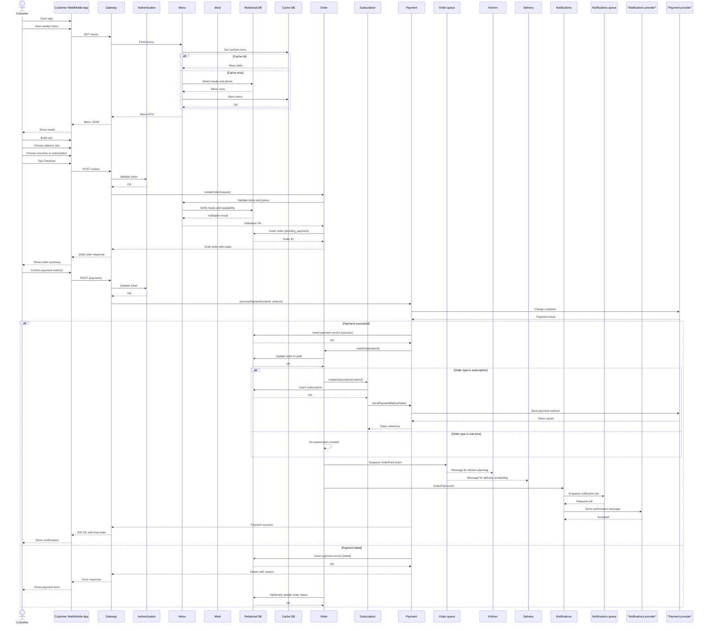
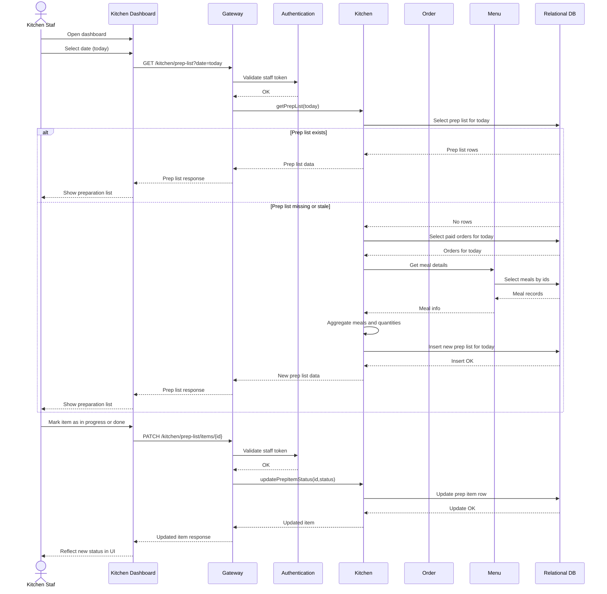
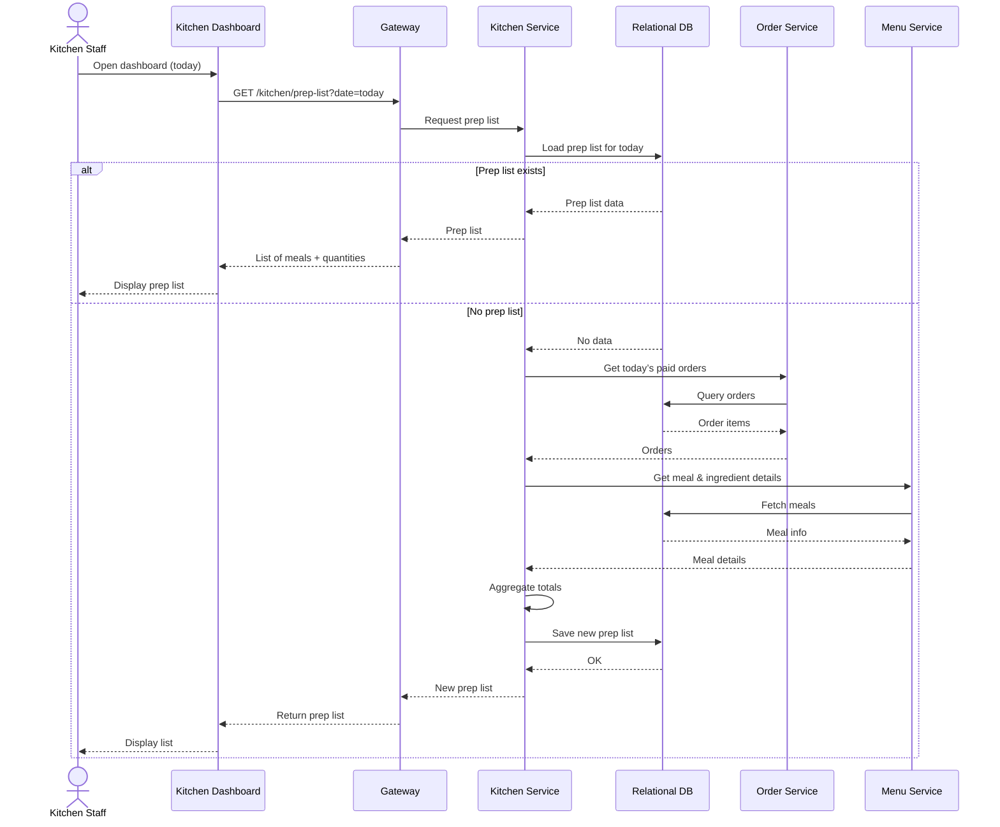
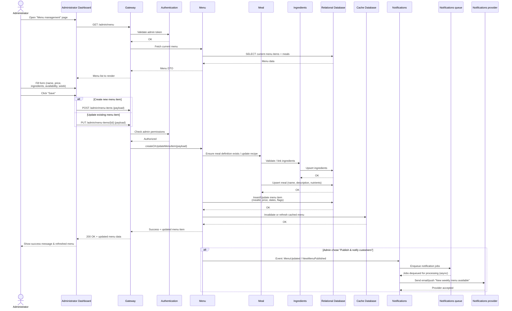

# DailyMeals
DailyMeals is a service that prepares and delivers fresh meals to people who want convenient, healthy food without having to cook every day. Customers can subscribe to weekly meal plans or order meals whenever they want. The goal of the system is to make the entire experience smooth — from choosing meals, to preparing them in the kitchen, to getting them delivered on time.

DailyMeals has several types of users:
- Customers, who look at the weekly menu, pick their meals, pay, and track deliveries.
- Kitchen staff, who see what meals need to be cooked each day and how many portions to prepare.
- Delivery drivers, who get their assigned routes and confirm when meals have been delivered.
- Administrators, who manage the menu, update prices, review orders, and handle issues.

Because all these people interact with the system differently, DailyMeals provides several different interfaces: a website or app for customers, internal dashboards for the kitchen and admin teams, and a simple mobile view for drivers.

The system also connects with outside services to handle things like payments, sending email or text updates, and mapping routes for deliveries.

Behind the scenes, DailyMeals keeps track of customers, meals, orders, ingredients, weekly menus, and delivery schedules. Some tasks happen automatically — like generating the list of meals the kitchen must prepare each morning, charging weekly subscribers, or sending notifications as meals move through the delivery process.

Overall, DailyMeals is meant to represent a realistic, modern application: one that has multiple user roles, several parts working together, and real-world challenges like timing, coordination, and communication between different teams. The project will explore how to design this system in a clear and organized way so each part fits together smoothly.

## Project elements

### What are the elements of your project?
- **Customer App/Web**: where people browse meals, manage subscriptions, place orders, and track deliveries.
- **Kitchen Dashboard**: shows cooking plans, quantities needed, ingredient lists, and daily preparation tasks.
- **Delivery Driver App**: gives drivers their assigned routes and lets them confirm deliveries.
- **Admin Dashboard**: used by staff to publish menus, modify meals, review orders, handle refunds, and manage users.
- **Backend Services**: handle orders, subscriptions, menus, user accounts, payments, and weekly batch processing.
- **Data Storage**: for users, meals, ingredients, orders, delivery records, and meal-prep batches.
- **External Integrations**: payment provider, email/SMS notifications, and mapping/delivery tools.

### Which architectural patterns will apply?
DailyMeals will follow a modular service-based architecture (not fully microservices, but more separated than a monolith). Each major area—orders, menus, users, operations—acts as its own module, making the system easier to maintain and expand.
- **API-first design**: each frontend communicates through well-defined APIs.
- **Asynchronous processing**: for tasks like generating weekly cooking plans, creating batch orders, and sending notifications.
- **Event-driven moments**: when certain actions trigger automatic updates (e.g., “order paid” → “send confirmation” → “add to kitchen schedule”).
- **Role-based access**: so each user only sees what they need.

### How will the pieces communicate with each other?
- REST APIs between the frontends and the backend services.
- Internal service-to-service APIs for operations like payment validation, generating cooking lists, or updating delivery status.
- Message queues (or another async mechanism) for longer-running tasks such as:
  - creating a daily preparation schedule,
  - processing subscription renewals,
  - sending emails or SMS updates.
 
### What kind of authN and authZ will be needed where?
#### Customers
- Sign up/sign in with email + password or OAuth.
- Can manage their own orders, account details, and preferences.

#### Kitchen Staff
- Internal login.
- Access only to the kitchen dashboard: meal quantities, ingredient lists, and daily tasks.

#### Delivery Drivers

- Lightweight login (mobile-friendly).
- Access only to their assigned routes and delivery confirmations.

#### Administrators
- Stronger login requirements.
- Full access to menus, orders, refunds, reports, and user management.

## Project User Flows

### Core User Flows
1. User signs up for an account
2. User logs in and gets a session/token
3. Customer views weekly menu
4. Customer places an order (one-time or subscription)
5. Subscription renewal processing (automatic behind the scenes)
6. Kitchen staff views daily prep list
7. Delivery driver updates delivery status
8. Admin creates or updates a menu item
9. System sends notifications to user (order confirmation, delivery update)
10. Customer tracks delivery progress

### Unique Flows
#### Customer places an order (one-time or subscription)

#### Kitchen staff view of preparation list

#### Delivery driver updates

#### Admin creates or updates a menu item

